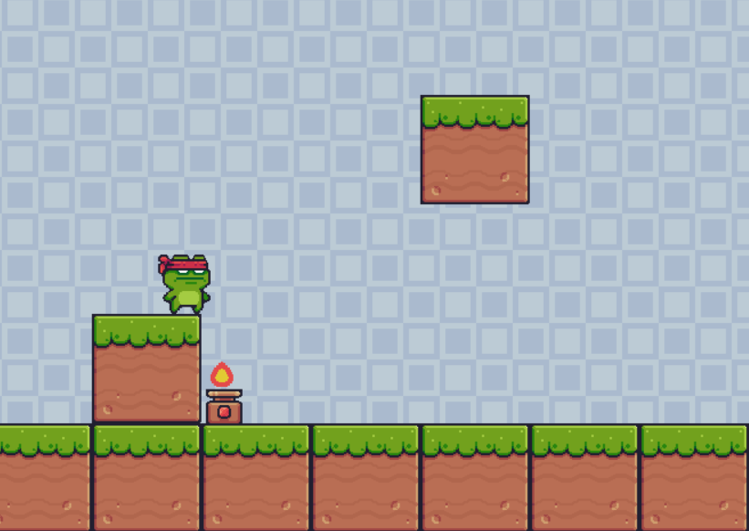

# Python-Platformer

Platformer is a Super Mario-like inspired game that allows developers to adjust the game according to their needs. The game is built using <b>Python</b> and the <b>Pygame</b> library.

##Requirements

Python 3.x

Pygame library

credits to Tech With Tim Channel